# AWS Cross-Account Role Switching Lab

## Accessing S3 Storage Buckets Across Two AWS Accounts Using IAM Roles

---

## Table of Contents

- [Overview](#overview)
- [What You Will Learn](#what-you-will-learn)
- [Architecture Diagram](#architecture-diagram)
- [Prerequisites](#prerequisites)
- [Your Lab Setup](#your-lab-setup)
- [Step 1 — Create a Second AWS Account (Account B)](#step-1--create-a-second-aws-account-account-b)
- [Step 2 — Upload a Test File to Account B's S3 Bucket](#step-2--upload-a-test-file-to-account-bs-s3-bucket)
- [Step 3 — Create the Cross-Account Role in Account B](#step-3--create-the-cross-account-role-in-account-b)
- [Step 4 — Create the Jump Policy in Account A](#step-4--create-the-jump-policy-in-account-a)
- [Step 5 — Attach the Jump Policy to junior-cloud-engineer](#step-5--attach-the-jump-policy-to-junior-cloud-engineer)
- [Step 6 — Perform the Role Switch](#step-6--perform-the-role-switch)
- [What Just Happened — Explained](#what-just-happened--explained)
- [Key Concepts](#key-concepts)
- [Common Errors and Fixes](#common-errors-and-fixes)
- [Security Best Practices](#security-best-practices)
- [Cleanup](#cleanup)

---

## Overview

In the real world, companies use multiple AWS accounts to separate environments — for example, one account for development, another for production, another for security auditing. A common challenge is allowing a user in one account to safely access resources in another account **without creating new passwords or credentials**.

This lab walks through the complete setup of **AWS Cross-Account Role Switching** — the industry-standard solution to this problem. By the end, a restricted IAM user in Account A will be able to view S3 buckets in Account B using only temporary, automatically expiring credentials.

---

## What You Will Learn

- How IAM Roles work as temporary identities
- How AWS Security Token Service (STS) generates temporary credentials
- How to configure a **trust policy** so one account trusts another
- How to create a **least-privilege permission policy**
- How to perform a **role switch** in the AWS console
- Why this pattern is more secure than sharing passwords or access keys

---

## Architecture Diagram

```
┌─────────────────────────────────────┐         ┌──────────────────────────────────────┐
│         ACCOUNT A (367213325880)    │         │        ACCOUNT B (202324795125)      │
│         Identity Account            │         │        Resource Account              │
│                                     │         │                                      │
│  ┌──────────────────────────────┐   │         │  ┌────────────────────────────────┐  │
│  │   junior-cloud-engineer      │   │         │  │  CrossAccount-Storage-Access   │  │
│  │   (IAM User)                 │   │  sts:   │  │  (IAM Role)                    │  │
│  │                              │─ ─AssumeRole ─▶│                                │  │
│  │   Policies attached:         │   │         │  │  Trust Policy:                 │  │
│  │   • S3-ReadOnly-PublicAssets │   │         │  │  Trusts Account A (367213...)  │  │
│  │   • Permission-To-Jump-To-   │   │         │  │                                │  │
│  │     AccountB                 │   │         │  │  Permissions:                  │  │
│  └──────────────────────────────┘   │         │  │  AmazonS3ReadOnlyAccess        │  │
│                                     │         │  └────────────────────────────────┘  │
│  ┌──────────────────────────────┐   │         │                                      │
│  │   lab-user (Admin)           │   │         │  ┌────────────────────────────────┐  │
│  │   Does all setup work        │   │         │  │  S3 Bucket                     │  │
│  └──────────────────────────────┘   │         │  │  cross-account-lab-bucket1     │  │
│                                     │         │  └────────────────────────────────┘  │
└─────────────────────────────────────┘         └──────────────────────────────────────┘
         │                                                        ▲
         │              temporary STS credentials                 │
         └────────────────────────────────────────────────────────┘
                     (expire automatically after 1 hour)
```

**The two-sided handshake:**
- Account B's role says: *"I trust users from Account A to assume me"*
- Account A's policy says: *"junior-cloud-engineer is allowed to assume that role"*
- **Both sides are required.** Missing either = Access Denied.

---

## Prerequisites

| Requirement | Details |
|---|---|
| AWS Account A | An existing AWS account with IAM access |
| AWS Account B | A new second AWS account (free tier is fine) |
| lab-user | An IAM admin user in Account A to do the setup |
| junior-cloud-engineer | A restricted IAM user in Account A — this is the user who jumps |
| S3 bucket in Account B | Created during the lab |

---

## Your Lab Setup

| | Account ID | Purpose |
|---|---|---|
| Account A | `367213325880` | Where junior-cloud-engineer lives |
| Account B | `202324795125` | Where the S3 data lives |

**Users in Account A:**

| User | Permissions | Role in this lab |
|---|---|---|
| `lab-user` | AdministratorAccess | Creates all the policies and roles |
| `junior-cloud-engineer` | S3-ReadOnly-PublicAssets (restricted) | Performs the actual role switch |

---

## Step 1 — Create a Second AWS Account (Account B)

Since cross-account access requires two **different** AWS accounts with different Account IDs, we need to create a second account.

> **Why can't we use two IAM users in the same account?**
> Cross-account role switching requires two genuinely separate Account IDs. Two IAM users in the same account share the same Account ID — there is no "cross-account" trust to configure. They are already in the same account.

### How to create Account B

1. Open a new **incognito/private browser window** — this keeps the two account sessions separate
2. Go to [https://aws.amazon.com/free](https://aws.amazon.com/free) and click **Create a Free Account**
3. Fill in the signup form:
   - **Email address** — use a Gmail alias trick: if your email is `john@gmail.com`, use `john+awsB@gmail.com`. AWS treats it as a unique email; Gmail delivers it to your same inbox
   - **AWS account name** — use `Lab-Account-B` so you can easily identify it
   - **Password** — any strong password
4. Complete phone verification and billing (AWS charges $1 temporarily to verify the card — it is refunded)
5. Select **Basic support — Free** when asked about a support plan

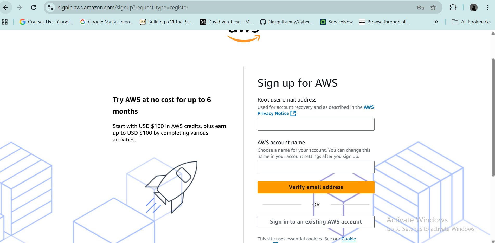
*The AWS signup page. Use a Gmail alias for the email field to create a second account without needing a second email address.*

6. After signup, log into Account B and note the **12-digit Account ID** from the top-right dropdown

---

## Step 2 — Upload a Test File to Account B's S3 Bucket

While logged into Account B as root, create an S3 bucket and upload a test file. This gives us something to see when junior-cloud-engineer jumps over.

1. Go to **S3 → Create bucket**
2. Name it `cross-account-lab-bucket1`
3. Select any region (eu-north-1 Stockholm was used here)
4. Leave all other settings as default and click **Create bucket**
5. Click into the bucket → **Upload** → upload any small text file

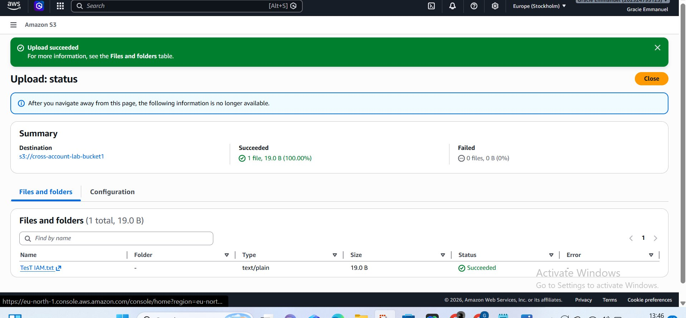
*A test file called `TesT IAM.txt` (19 bytes) successfully uploaded to `cross-account-lab-bucket1` in Account B. This is what junior-cloud-engineer will be able to see after the role switch.*

---

## Step 3 — Create the Cross-Account Role in Account B

This is the most important step. You are creating a **Role** in Account B that:
- Contains the S3 read permissions
- Has a trust policy that says "Account A users can assume me"

Think of this role as a **jacket hanging in Account B's wardrobe** — anyone from Account A who has the right permission slip can put it on.

> **Stay logged into Account B for this entire step.**

### 3a — Navigate to IAM Roles

Go to **IAM → Roles** in the left sidebar → click **Create role**

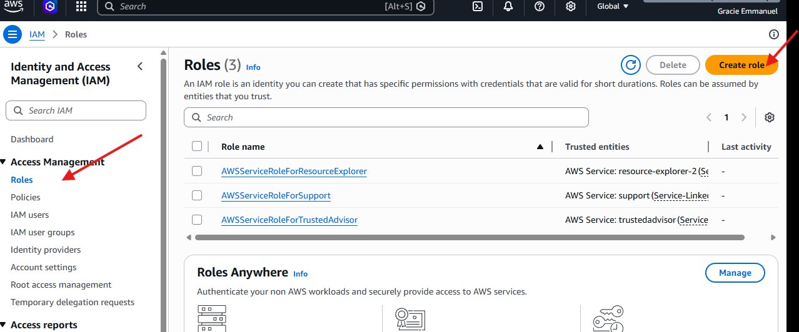
*The IAM Roles page in Account B showing 3 default AWS service roles. We click "Create role" to add a new cross-account role. Note: you are logged in as `Gracie Emmanuel` (Account B root).*

### 3b — Select trusted entity type

On the "Select trusted entity" screen:

1. Select **AWS account** as the trusted entity type
2. Select **Another AWS account**
3. In the **Account ID** field, paste Account A's ID: `367213325880`
4. Leave **Require external ID** and **Require MFA** **unchecked** (this is a learning lab)
5. Click **Next**

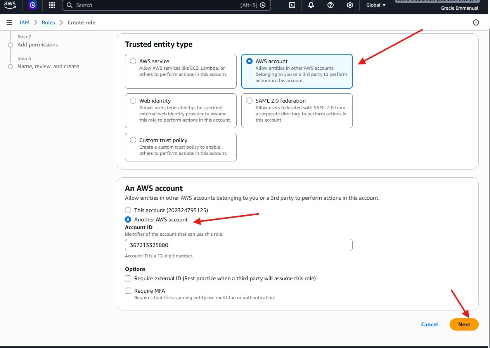
*Selecting "AWS account" → "Another AWS account" and entering Account A's ID (367213325880). This is the trust policy being built — it tells Account B "allow entities from Account A to assume this role". The two options left unchecked (External ID and MFA) are production hardening features — important for real deployments but kept simple here.*

### 3c — Add permissions

1. In the search box type: `AmazonS3ReadOnlyAccess`
2. Check the checkbox next to it
3. Click **Next**

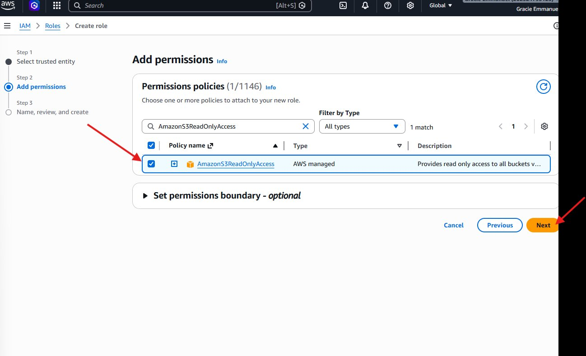
*Selecting `AmazonS3ReadOnlyAccess` — an AWS-managed policy that grants read-only access to all S3 buckets in the account. This is the **least privilege** principle in action: we give the minimum permissions needed (read only) rather than full access. The role will be able to list and download objects but cannot create, modify, or delete anything.*

### 3d — Name and create the role

1. **Role name**: `CrossAccount-Storage-Access`
   - Spelling, capitalisation, and hyphens must be exact — this name is used when switching roles
2. **Description**: `Allows junior-cloud-engineer in Account A to read Account B S3 buckets`
3. Scroll down and verify the summary shows:
   - Trusted entity: `367213325880` (Account A)
   - Permissions: `AmazonS3ReadOnlyAccess`
4. Click **Create role**

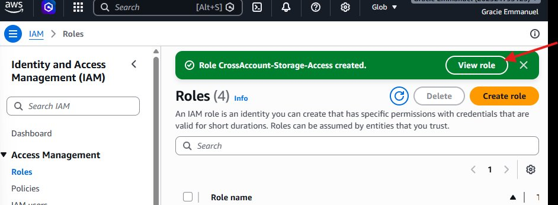
*The green success banner confirms "Role CrossAccount-Storage-Access created". The Roles count jumped from 3 to 4. Click "View role" to find and copy the Role ARN you'll need in the next step.*

### 3e — Copy the Role ARN

After creation, click **View role** → at the top of the role detail page, copy the ARN:

```
arn:aws:iam::202324795125:role/CrossAccount-Storage-Access
```

> **Save this ARN.** You will paste it into Account A's policy in the next step. A wrong ARN = Access Denied with no clear error message.

---

## Step 4 — Create the Jump Policy in Account A

Now switch to Account A. Log in as **`lab-user`** (the admin). You are creating a policy that gives junior-cloud-engineer permission to make the `sts:AssumeRole` API call — the single action that performs the role switch.

> **Why STS and not S3?**
> The jump policy is about *identity switching*, not about *reading data*. STS (Security Token Service) is the AWS service that handles identity. S3 permissions live inside the role in Account B — that's what controls what junior-cloud-engineer can do once they've jumped.

### 4a — Navigate to IAM Policies

Go to **IAM → Policies** in the left sidebar → click **Create policy**

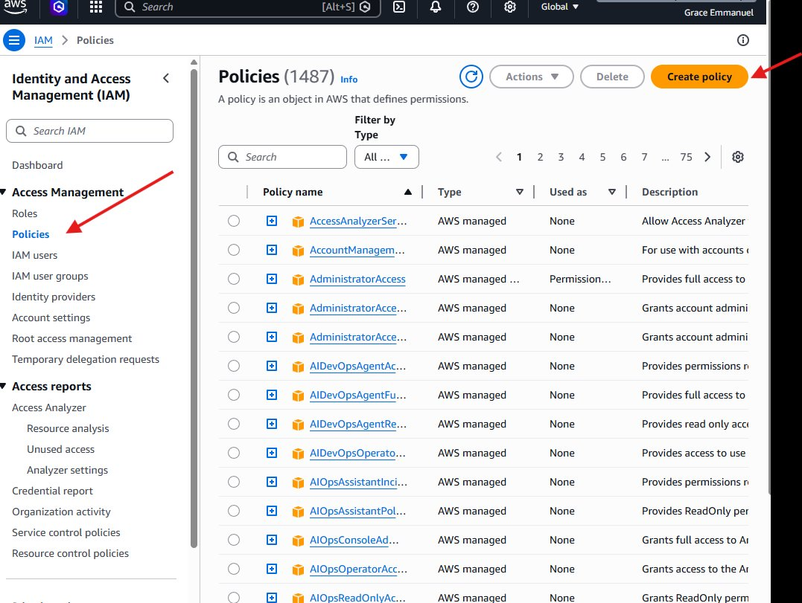
*The IAM Policies list in Account A (logged in as Grace Emmanuel / lab-user). Over 1,487 policies exist — mostly AWS-managed. We click "Create policy" to add our custom jump policy.*

### 4b — Enter the policy JSON

1. Click the **JSON** tab in the policy editor
2. Clear the existing content and paste this exactly:

```json
{
  "Version": "2012-10-17",
  "Statement": [
    {
      "Effect": "Allow",
      "Action": "sts:AssumeRole",
      "Resource": "arn:aws:iam::202324795125:role/CrossAccount-Storage-Access"
    }
  ]
}
```

3. Click **Next**

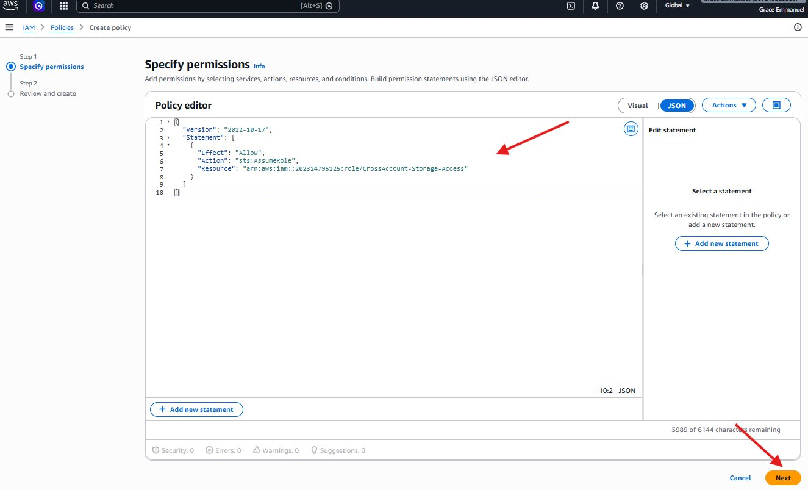
*The JSON policy editor showing the jump policy. Three fields matter:*
- ***Effect: Allow*** — grants the permission (never change this to Deny here)*
- ***Action: sts:AssumeRole*** — the single API call that performs the jump. This is an STS action, not an S3 action*
- ***Resource*** — the full ARN of the specific role in Account B. This limits junior-cloud-engineer to jumping ONLY to this one role — not any role in any account*

### 4c — Name and create the policy

1. **Policy name**: `Permission-To-Jump-To-AccountB`
2. **Description**: `Allows junior-cloud-engineer to assume the cross-account role in Account B`
3. Verify the summary shows:
   - Service: **STS**
   - Access level: **Limited: Write**
   - Resource: `CrossAccount-Storage-Access`
4. Click **Create policy**

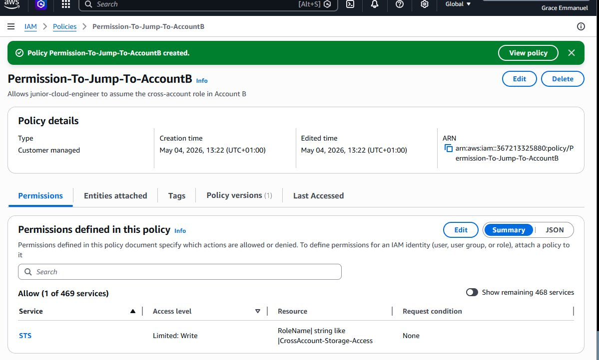
*The policy `Permission-To-Jump-To-AccountB` created successfully. The summary confirms: Service = STS, Access level = Limited: Write, Resource = the CrossAccount-Storage-Access role in Account B. The policy ARN is `arn:aws:iam::367213325880:policy/Permission-To-Jump-To-AccountB`.*

---

## Step 5 — Attach the Jump Policy to junior-cloud-engineer

Still in Account A as lab-user. Find the `junior-cloud-engineer` user and attach the policy you just created alongside their existing S3 policy.

> **Key principle:** We are adding a second policy — we are NOT modifying or replacing the existing `S3-ReadOnly-PublicAssets` policy. In IAM, policies stack — a user's effective permissions are the union of all their attached policies.

### 5a — Find the user and check existing permissions

Go to **IAM → Users → junior-cloud-engineer** → click the **Permissions** tab

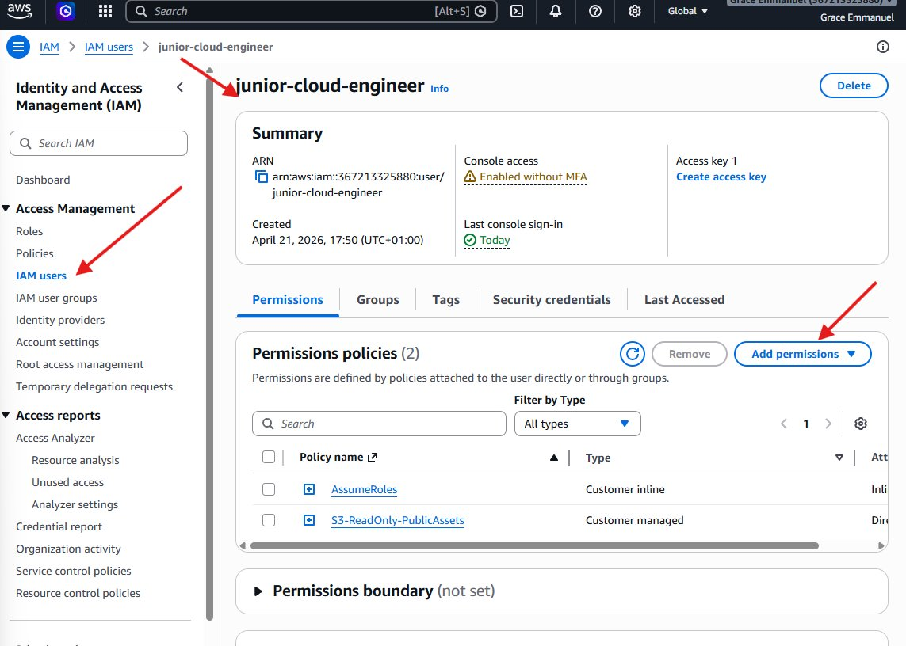
*junior-cloud-engineer currently has 2 policies: `AssumeRoles` (a custom inline policy) and `S3-ReadOnly-PublicAssets` (the policy from the previous lab). We need to add a third policy — the jump policy. Click "Add permissions".*

### 5b — Attach the jump policy

1. Click **Add permissions** → select **Attach policies directly**
2. Search for `Permission-To-Jump-To-AccountB`
3. Check the checkbox next to it
4. Click **Next** → **Add permissions**

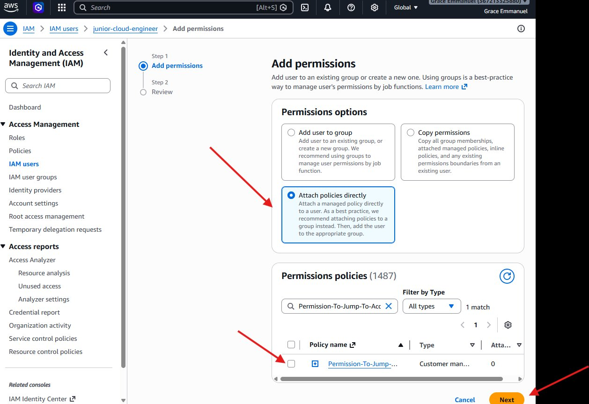
*The Add permissions screen showing "Attach policies directly" selected and `Permission-To-Jump-To-AccountB` found with 1 match. Check the checkbox and click Next.*

### 5c — Confirm the policy was added

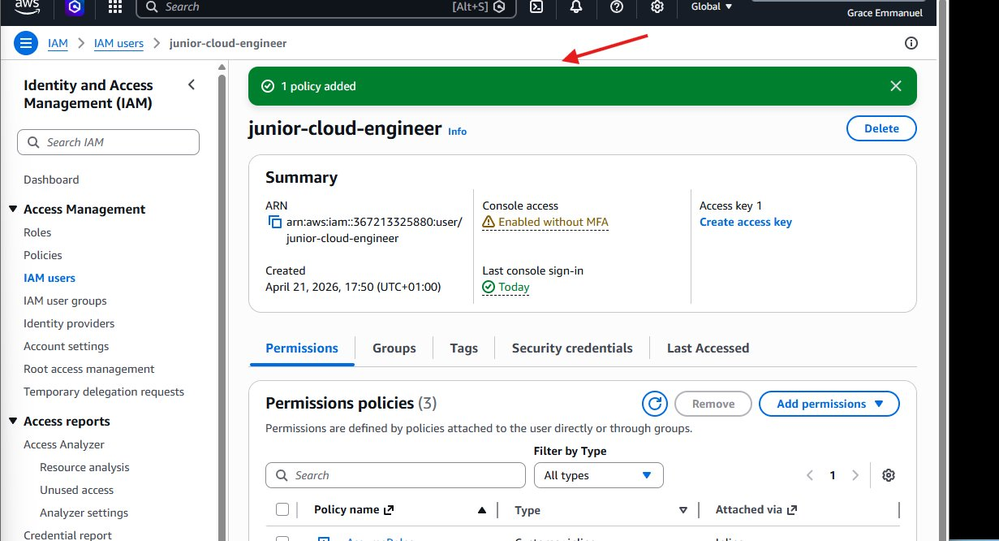
*The green banner confirms "1 policy added". junior-cloud-engineer now has 3 policies attached (count changed from 2 to 3). The new jump policy is now live and active.*

**junior-cloud-engineer's complete permissions at this point:**

| Policy | Type | What it does |
|---|---|---|
| `S3-ReadOnly-PublicAssets` | Customer managed | Read `companypublic-assets` bucket in Account A |
| `AssumeRoles` | Customer inline | (Pre-existing from previous lab) |
| `Permission-To-Jump-To-AccountB` | Customer managed | Jump to Account B's role via STS |

---

## Step 6 — Perform the Role Switch

All configuration is complete. Now log out of lab-user and log back in as **`junior-cloud-engineer`**. This is where the magic happens.

### 6a — Open the Switch Role menu

While logged in as junior-cloud-engineer, click your **username at the top right** of the AWS console → click **Switch role**

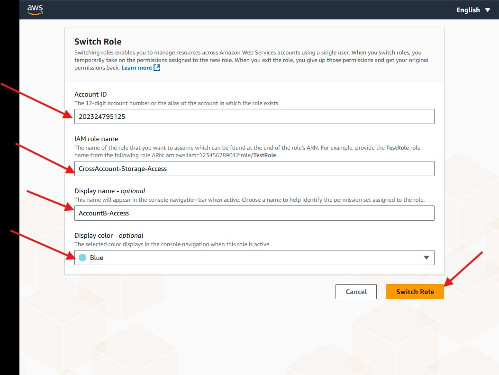
*Clicking the username dropdown as junior-cloud-engineer reveals the account menu. The "Switch role" button is at the bottom. Notice "Account name" and "Account colour" show "Access denied" — this confirms junior-cloud-engineer is a restricted user with no admin access. Click "Switch role".*

### 6b — Fill in the Switch Role form

Enter the following details exactly:

| Field | Value | Why |
|---|---|---|
| Account ID | `202324795125` | Account B's 12-digit ID — where the role lives |
| IAM role name | `CrossAccount-Storage-Access` | The exact name of the role created in Step 3 |
| Display name | `AccountB-Access` | Friendly label shown in the top bar after switching |
| Display color | Blue (or any color) | Colors the top bar so you always know you're in Account B |

Click **Switch Role**

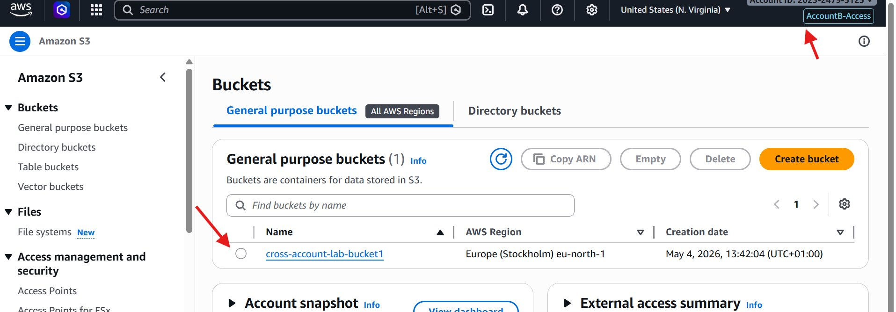
*The Switch Role form filled in with all four fields. Account ID is Account B's ID, role name matches exactly what was created in Step 3, display name is a friendly label, and a color is chosen. AWS will call STS behind the scenes to generate temporary credentials scoped to Account B.*

### 6c — Confirm the jump worked

After clicking Switch Role, you will see the console reload with:
- A **colored badge** (`AccountB-Access`) in the top right corner
- The **Account ID changing** to `202324795125` (Account B)

Go to **S3** — you will see Account B's buckets.

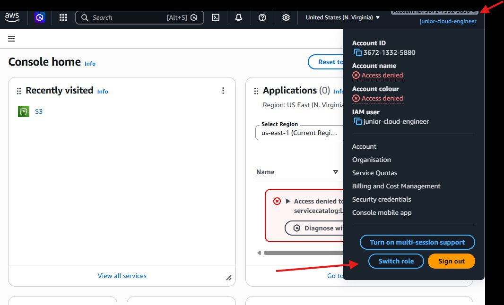
*Success! The top bar shows `AccountB-Access` badge and Account ID `202324795125` (Account B). The S3 console shows `cross-account-lab-bucket1` — Account B's bucket that junior-cloud-engineer has never had credentials for. The role switch generated temporary STS credentials valid for 1 hour.*

---

## What Just Happened — Explained

Here is the exact sequence of events when junior-cloud-engineer clicked **Switch Role**:

```
1. Browser sends: sts:AssumeRole API call
   → Role ARN: arn:aws:iam::202324795125:role/CrossAccount-Storage-Access
   → Caller: arn:aws:iam::367213325880:user/junior-cloud-engineer

2. STS checks Account A:
   → Does junior-cloud-engineer have permission to call sts:AssumeRole on this ARN?
   → YES — Permission-To-Jump-To-AccountB policy allows it

3. STS checks Account B's role trust policy:
   → Does CrossAccount-Storage-Access trust Account A (367213325880)?
   → YES — trust policy lists 367213325880 as a trusted principal

4. Both checks pass. STS generates temporary credentials:
   → AccessKeyId: ASIA...
   → SecretAccessKey: (temporary)
   → SessionToken: (temporary)
   → Expiry: 1 hour from now

5. Browser uses these temporary credentials for all subsequent API calls
   → All calls are scoped to Account B
   → Permissions are limited to AmazonS3ReadOnlyAccess
```

**Before vs After the switch:**

| | Before switch | After switch |
|---|---|---|
| Identity | junior-cloud-engineer (permanent IAM user) | CrossAccount-Storage-Access (temporary role session) |
| Account | Account A (367213325880) | Account B (202324795125) |
| Credentials | Long-term IAM user keys | Temporary STS token (1 hour) |
| S3 access | companypublic-assets in Account A only | All buckets in Account B (read only) |
| Can delete anything? | No | No |
| Password needed for Account B? | No | No |

---

## Key Concepts

### IAM Role vs IAM User

| IAM User | IAM Role |
|---|---|
| Has a permanent identity | Has a temporary identity |
| Has long-term credentials (password + access keys) | Has no credentials — generates temporary ones via STS |
| Belongs to one account | Can be assumed by users from other accounts |
| Like an employee badge | Like a visitor pass |

### Trust Policy vs Permission Policy

Every IAM Role has two separate policies:

| Policy type | Controls | In this lab |
|---|---|---|
| **Trust policy** | *Who can assume this role* | Account A (367213325880) is trusted |
| **Permission policy** | *What this role can do* | AmazonS3ReadOnlyAccess |

Both must be correct for the role switch to work.

### Least Privilege

Notice that junior-cloud-engineer:
- Can only jump to **one specific role** (not any role in any account)
- Once jumped, can only **read** S3 objects (not write, delete, or manage them)
- Temporary credentials **expire automatically** after 1 hour

This is the principle of least privilege — give the minimum permissions needed to do the job, nothing more.

---

## Common Errors and Fixes

### AccessDenied when switching roles

Check these in order:

1. **Is the trust policy correct?**
   - Go to Account B → IAM → Roles → CrossAccount-Storage-Access → Trust relationships
   - Confirm Account A's ID (`367213325880`) appears in the Principal field
   - A common mistake is leaving the placeholder `123456789012` in the trust policy

2. **Is the jump policy ARN correct?**
   - Go to Account A → IAM → Policies → Permission-To-Jump-To-AccountB → JSON
   - Confirm the Resource field contains `arn:aws:iam::202324795125:role/CrossAccount-Storage-Access`
   - One wrong character causes a silent AccessDenied

3. **Is the jump policy attached to junior-cloud-engineer?**
   - Go to Account A → IAM → Users → junior-cloud-engineer → Permissions
   - Confirm `Permission-To-Jump-To-AccountB` appears in the list

### "No such role" when switching

- Go to Account B → IAM → Roles and confirm the role is named exactly `CrossAccount-Storage-Access`
- Check for trailing spaces, wrong capitalisation, or missing hyphens
- In the Switch Role dialog, confirm you entered Account B's Account ID (`202324795125`), not Account A's

### Session expired

- Temporary STS credentials expire after 1 hour by default
- Simply click Switch Role again — it takes 10 seconds
- This is expected and secure behavior

### "Access denied" errors on the console home page

- Errors like "Access denied to servicecatalog:ListApplications" on the AWS console home are **normal and expected**
- The console home tries to load widgets that require permissions the role doesn't have
- These errors do not affect your ability to use S3
- Simply navigate directly to S3 and ignore the home page errors

---

## Security Best Practices

This lab demonstrates a basic setup. For production environments, add these hardening measures:

### 1. Require MFA before role switch

Add a condition to the trust policy in Account B:

```json
"Condition": {
  "Bool": {
    "aws:MultiFactorAuthPresent": "true"
  }
}
```

This forces junior-cloud-engineer to have an active MFA session before the jump is allowed — protecting against stolen credentials.

### 2. Add an External ID (for third-party access)

```json
"Condition": {
  "StringEquals": {
    "sts:ExternalId": "your-unique-secret-value"
  }
}
```

This prevents the **confused deputy problem** — where a malicious actor tricks a service into assuming a role on their behalf.

### 3. Use groups instead of attaching policies directly to users

Instead of attaching `Permission-To-Jump-To-AccountB` directly to junior-cloud-engineer, create a group called `CrossAccountEngineers` and attach the policy to the group. Then add users to the group. This scales better and is easier to revoke.

### 4. Enable CloudTrail logging

Every `sts:AssumeRole` call is logged in CloudTrail. In production, ensure CloudTrail is enabled in both accounts so you have a full audit trail of every role switch — who jumped, when, and what they did.

### 5. Set a maximum session duration

By default, role sessions last 1 hour. You can increase this on the role settings (up to 12 hours) or decrease it for more sensitive roles. Match the session duration to the actual time needed for the task.

---

## Cleanup

To avoid any unintended access after the lab, clean up in this order:

**In Account A:**
1. IAM → Users → junior-cloud-engineer → remove `Permission-To-Jump-To-AccountB`
2. IAM → Policies → delete `Permission-To-Jump-To-AccountB`

**In Account B:**
1. IAM → Roles → delete `CrossAccount-Storage-Access`
2. S3 → empty `cross-account-lab-bucket1` → delete bucket

---

## Summary

In this lab, I:

- Created two separate AWS accounts and mapped their Account IDs
- Created an IAM Role in Account B with a trust policy pointing to Account A
- Created a least-privilege STS jump policy in Account A
- Attached the jump policy to a restricted IAM user
- Performed a live role switch and accessed Account B's S3 buckets
- Learned how temporary STS credentials work behind the scenes

This pattern — cross-account role switching — is used in virtually every multi-account AWS environment in the real world. It is the foundation of AWS Organizations, Security Hub, and any architecture where resources and identities live in separate accounts.

---

## Author

**Gracie Emmanuel** 
Lab completed: May 4, 2026  
AWS Accounts used: `367213325880` (Account A) and `202324795125` (Account B)

---

*This lab was completed as part of an AWS IAM learning series covering identity, access management, and cross-account security patterns.*
